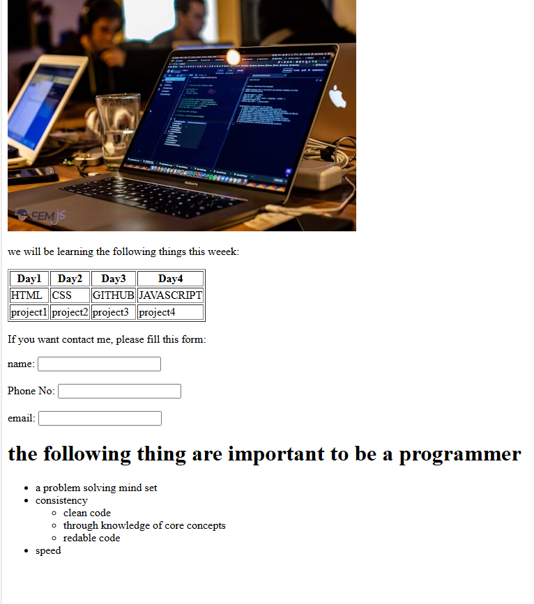

Here's a `README.md` for your HTML file that describes the purpose and structure of the content:

---

# HTML Learning Week - Webpage

This is a simple HTML webpage designed to showcase a week's learning plan for beginners in web development. The content includes a schedule, a contact form, and a list of important traits for a programmer. It also provides a basic structure for how you can organize content in an HTML document.

## Features

* **Learning Schedule Table**: A table displaying a 4-day learning plan that covers HTML, CSS, GitHub, and JavaScript, with corresponding projects for each day.
* **Contact Form**: A simple form to collect user information like name, phone number, and email.
* **Important Traits for a Programmer**: A list outlining the key qualities that make a good programmer.
* **Responsive Image**: An image from Unsplash to visually enhance the page.




## Structure

### HTML Head

* **Meta Tags**: Includes `charset` and `viewport` settings for better accessibility and mobile responsiveness.
* **Title**: The title of the document is set to "Document".

### HTML Body

* **Image**: A sample image from Unsplash is included at the top of the page.
* **Text Content**: A description of the week's learning topics is provided in the form of a paragraph and a table.
* **Learning Table**: Displays the topics and associated projects for each day of the week.
* **Contact Form**: A form to allow users to input their details, which includes fields for name, phone number, and email.
* **Programming Traits List**: An unordered list outlining essential traits for programmers, including problem-solving, consistency, and speed.

## Code Example

```html
<!DOCTYPE html>
<html lang="en">
<head>
    <meta charset="UTF-8">
    <meta name="viewport" content="width=device-width, initial-scale=1.0">
    <title>Document</title>
</head>
<body>
    <div>
      
      <p>we will be learning the following things this week:</p>
      <table border="">
        <thead>
            <tr>
                <th>Day1</th>
                <th>Day2</th>
                <th>Day3</th>
                <th>Day4</th>
            </tr>
        </thead>
        <tbody>
            <tr>
                <td>HTML</td>
                <td>CSS</td>
                <td>GITHUB</td>
                <td>JAVASCRIPT</td>
            </tr>
            <tr>
                <td>project1</td>
                <td>project2</td>
                <td>project3</td>
                <td>project4</td>
            </tr>
        </tbody>
      </table>
      <p>If you want contact me, please fill this form:</p>
      <form>
        <label for="name">name:
            <input type="text" id="name">
        </label>
        <br>
        <br>
        <label for="phone no">Phone No:
            <input type="text" id="phone no">
        </label>
        <br>
        <br>
        <label for="email">email:
            <input type="text" email>
        </label>
      </form>
      <h1>the following things are important to be a programmer</h1>
      <ul>
        <li>a problem-solving mindset</li>
        <li>consistency</li>
        <ul>
            <li>clean code</li>
            <li>through knowledge of core concepts</li>
            <li>readable code</li>
        </ul>
        <li>speed</li>
      </ul>
    </div>
</body>
</html>
```

## Installation

This is a simple HTML file, so there is no installation required. Simply:

1. Copy the HTML code into a file named `index.html`.
2. Open it in any modern browser to view the page.

## License

This project is licensed under the MIT License - see the [LICENSE](LICENSE) file for details.

---

You can adjust and expand this README as needed based on any additional functionality or specifics you'd like to highlight!
